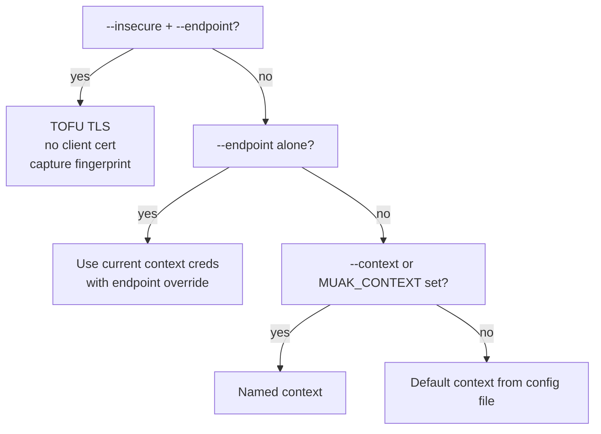

`muakctl` is the command-line client for Muak. It communicates with the node over
mTLS gRPC (HTTP/2). Every Muak operation like installing, managing VMs, updating, inspecting logs
and more is performed through `muakctl`.

## Installation

### From source

```sh
git clone https://github.com/muak-os/muak
cd muak
cargo build --release --bin muakctl --target x86_64-unknown-linux-musl
# Binary: target/x86_64-unknown-linux-musl/release/muakctl
```

Copy the binary to a directory in your `$PATH`:

```sh
install -m 755 target/x86_64-unknown-linux-musl/release/muakctl /usr/local/bin/muakctl
```

## Configuration file

`muakctl` stores connection contexts in `~/.config/muak/config.toml`.
The path can be overridden with the `MUAK_CONFIG` environment variable.

A context contains:
- `endpoint` — server address and port
- `ca` — base64-encoded CA certificate (for server verification)
- `cert` — base64-encoded client certificate
- `key` — base64-encoded client private key

The `context` key at the top level names the currently active context.

Example:

```toml
context = "my-node"

[contexts.my-node]
endpoint = "192.168.1.10:50051"
ca = "LS0tLS1CRUdJTi..."
cert = "LS0tLS1CRUdJTi..."
key = "LS0tLS1CRUdJTi..."
```

This file is populated automatically by `muakctl install` and `muakctl auth`.

## Global flags

| Flag | Env var | Description |
|---|---|---|
| `--endpoint <host:port>` | — | Override the server address for this command |
| `--context <name>` | `MUAK_CONTEXT` | Use a named context instead of the default |
| `--insecure` | — | TOFU mode: skip server cert verification; requires `--endpoint` |

## Connection priority

When determining how to connect, `muakctl` checks in this order:



## Contexts

Manage named connection profiles. All context commands are fully offline — no server connection.

```sh
muakctl context add my-node --endpoint 192.168.1.10:50051
muakctl context list
muakctl context use my-node
muakctl context remove my-node
```

## Authentication (enrollment)

Before any authenticated command can be used, a client certificate must be enrolled. Use the
TOFU flow on first connect:

```sh
muakctl auth --insecure --endpoint <host:port>
```

This generates an ECDSA P-256 keypair, submits a CSR to the server, and polls until an admin
approves it. Once approved, the cert and CA are saved automatically to the config file.

For the full enrollment flow, see [security/certificate-authorities.md](../security/certificate-authorities.md).
