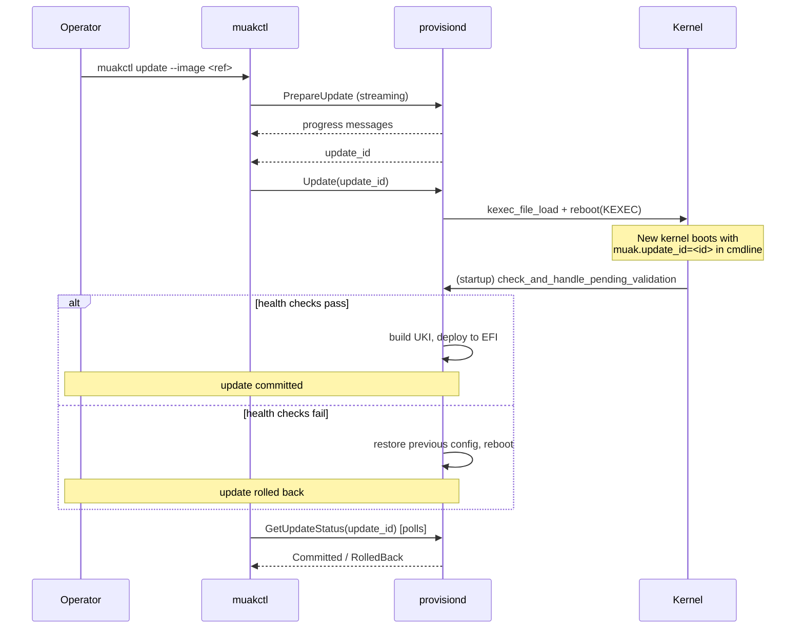

Muak updates are atomic: the running system is never partially modified. Either the new kernel boots and passes
validation, or the system automatically reverts to the previous state. There is no manual rollback step and no
ambiguous intermediate state.

## How it works

Updates proceed in two phases separated by a `kexec` reboot.



### Phase 1: Prepare

`muakctl update` does the following:

1. Pulls the new OS image and any extensions into a staging directory at `/run/state/update/`.
2. Saves a snapshot of the current config (`/run/state/config.toml`) into the staging directory as
   `update-<timestamp>.<ext>`. This snapshot is used to restore the previous state if the update fails.
3. Merges the incoming config (if one was provided) with the current config, preserving immutable fields such as
   `system.disk`.
4. Records the change in the config history at `/run/state/history/`.

The streaming response emits progress messages and completes with the assigned `update_id`
(e.g. `update-1748000000`).

### Phase 2: Activate

`muakctl update` immediately follows with `ProvisionService/Update(update_id)`, which calls `kexec_file_load`
with the staged kernel and initramfs, then issues `reboot(KEXEC)`. The system transfers control to the new
kernel without a hardware reset. The original cmdline is preserved and `muak.update_id=<id>` is appended.

### Phase 3: Validate and commit

On the first startup under the new kernel, `provisiond` runs `check_and_handle_pending_validation`:

1. It scans `/run/state/update/` for a pending snapshot file.
2. It checks that `muak.update_id=<id>` is present in `/proc/cmdline`. If the marker is absent, the kexec did
   not land on the new kernel (kexec failure) and the system rolls back immediately.
3. It runs health checks:
   - STATE partition is writable (`/run/state` write test).
   - At least one non-loopback network interface is present.
4. If all checks pass, it **commits**: builds the UKI from the staged components, optionally signs it and
   enrolls Secure Boot keys, and deploys it to the EFI partition. The staging directory is then removed.
5. If any check fails, it **rolls back**: restores the config snapshot, removes the staging directory, records
   the failure reason, and issues a standard reboot back into the previous EFI image.

### Polling for the outcome

`muakctl` polls `ProvisionService/GetUpdateStatus` every two seconds (timeout: five minutes) after the kexec
reboot. Possible statuses:

| Status | Meaning |
|---|---|
| `Pending` | Staging files exist; validation not yet complete |
| `Committed` | Update deployed to EFI; system is running the new image |
| `RolledBack` | Validation failed; reason is included in the response |
| `Unknown` | No record of this update ID on the system |

## Update with a new config

Pass `--config <file.toml>` instead of `--image` to supply both a new image reference and updated
configuration in a single operation:

```sh
muakctl update --config new-config.toml
```

The new config is validated client-side before being sent to the server. The server re-validates it and rejects
any attempt to change immutable fields (`system.disk`) or downgrade the image version. All other fields in
`[system]`, `[network]`, and `[vm]` sections can be changed.

## Rollback records

Every automatic rollback is persisted to `/run/state/rollbacks/<update_id>.json`:

```json
{
  "update_id": "update-1748000000",
  "failed_image": "ghcr.io/example/muak:v1.2.0",
  "reason": "Health checks failed: STATE partition not writable",
  "rolled_back_at": 1748000042
}
```

Up to 1000 rollback records are retained. Check rollback history with:

```sh
muakctl config history
```

## Constraints

- **No downgrades.** The image version in an update must not be lower than the currently installed version.
  `muakctl` and `provisiond` both enforce this.
- **`system.disk` is immutable.** The target disk cannot be changed via an update; it is silently preserved
  from the current config.
- **`system.secureboot` cannot be disabled once enabled.** If Secure Boot is already active in firmware, any
  config that sets `secureboot = false` is rejected.
- **Secure Boot Setup Mode.** Enabling `secureboot = true` for the first time requires the firmware to be in
  Setup Mode. The update will be rejected at prepare time if the firmware is not in Setup Mode.
