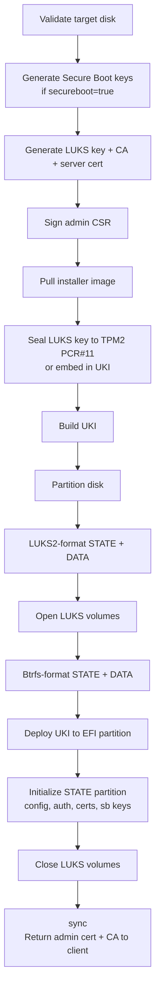

# Installation

Installation writes Muak to a physical disk. It is a one-time, destructive operation: the target disk is completely wiped and repartitioned. After a successful install, the system reboots into the installed image.

## Prerequisites

- A machine booted from a Muak installer image (live mode)
- A physical or virtual disk to install to
- A machine configuration file (`config.toml`) prepared in advance
- `muakctl` accessible on the installer machine or on a separate workstation

## Partition layout

Installation creates three GPT partitions:

| Partition | Label | Filesystem | Contents                                      |
|-----------|-------|------------|-----------------------------------------------|
| 1         | EFI   | FAT32      | UEFI boot entry; UKI `.efi` file              |
| 2         | STATE | LUKS2/Btrfs| Node config, secrets, auth config, update staging |
| 3         | DATA  | LUKS2/Btrfs| VM disk images and VM data subvolumes         |

## Installation steps

The `muakctl install` command drives the entire process over a streaming gRPC call. Progress messages are printed as each step completes.



## Running the installer

First, list available disks to identify the target:

```
muakctl --insecure --endpoint <host>:50051 disks
```

Then run the install:

```
muakctl --insecure --endpoint <host>:50051 install --config config.toml
```

After install completes, `muakctl` automatically saves the returned CA certificate and admin client certificate as a named context in `~/.config/muak/config.toml`. Subsequent commands use this context by default.

## Configuration file

The configuration file is a TOML document that specifies the target disk, system image, hostname, and optional Secure Boot and networking settings. See [Machine Configuration](../configure/machine-configuration.md) and [Configuration Reference](../reference/configuration.md) for a full reference.

## Force reinstall

If the target disk already has a valid Muak installation, the installer will refuse to proceed without `--force`:

```
muakctl --insecure --endpoint <host>:<port> install --config config.toml --force
```

`--force` skips the existing-installation check and proceeds with a full wipe.

## What happens to existing contexts

If `muakctl` detects that you already have credentials for the target endpoint, it will warn you and skip the install. Remove the existing context first:

```
muakctl context remove <context-name>
```
